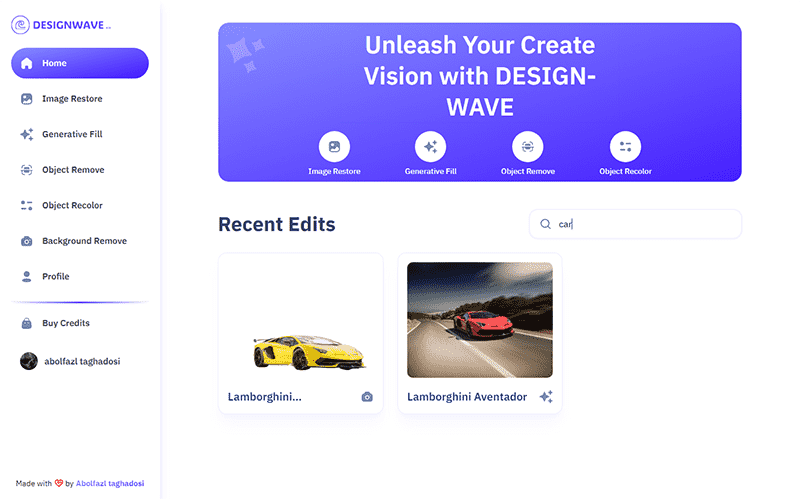
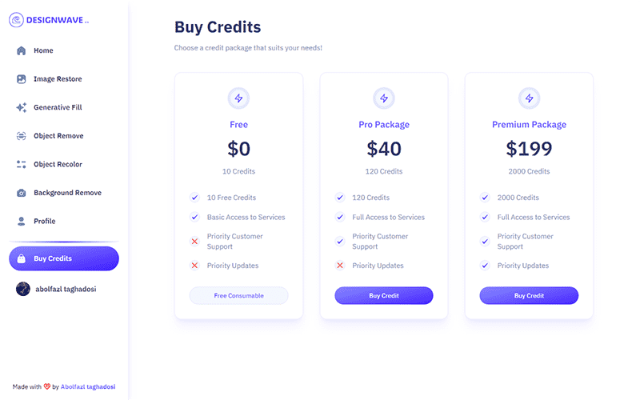

# 🚀 Design-Wave (canva clone)

### Design-Wave, is a large and captivating platform for editing photos using the power of AI. On the main page of this app, users can view edits made by others and also search for specific images. The highly advanced search system of this application allows us to search for images based on their title and content. If we navigate to an edited image page, we can view the before and after versions of the image and also download the edited image. Additionally, if we are the ones who edited the image, we can update or even delete it. The editing capabilities of this application include Restore Image, Background Remove, Generative Fill, Object Remove, and Object Recolor. As a regular user, we have only ten Credits to edit an image; if these Credits are exhausted, we must purchase a Premium package to continue editing photos. (اگه ایران هستید از فیلترشکن استفاده کنید)

## Link 🔗 [https://design-wave.vercel.app](https://design-wave.vercel.app)

 

# Preview

 

# Mobile Responsive

# Technologies

 

<ul>
    <li>
        
    </li>
    <li>
        
    </li>
    <li>
        
    </li>
    <li>
        
    </li>
    <li>
        
    </li>
    <li>
        
    </li>
    <li>
        
    </li>
    <li>
        
    </li>
</ul>
